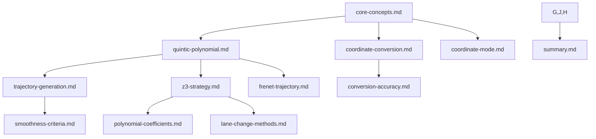

# Frenet Context - Navigation

## Overview
This directory contains organized knowledge about implementing Frenet coordinates in test-4. Information is structured into modular files focused on specific aspects of the implementation.

## File Organization

```
context/frenet/
├── domain/
│   ├── core-concepts.md           # Frenet coordinate fundamentals
│   └── quintic-polynomial.md      # Quintic polynomial algorithm
├── processes/
│   ├── trajectory-generation.md   # Trajectory generation workflow
│   └── coordinate-conversion.md   # Frenet ↔ Cartesian conversion
├── decisions/
│   ├── coordinate-mode.md         # Hybrid architecture decision
│   ├── z3-strategy.md             # Z3 integration approach
│   ├── polynomial-coefficients.md # Coefficient handling
│   ├── lane-change-methods.md     # Lane change algorithm choice
│   └── summary.md                 # All decisions summary
├── standards/
│   ├── smoothness-criteria.md     # Smoothness requirements
│   └── conversion-accuracy.md     # Conversion accuracy standards
├── templates/
│   └── frenet-trajectory.md       # Scenario template
└── navigation.md                  # This file
```

## Quick Reference

### By Category

| Category | File | Purpose | Lines |
|----------|------|---------|-------|
| **Domain** | core-concepts.md | Frenet definitions, formulas | ~130 |
| **Domain** | quintic-polynomial.md | Quintic algorithm details | ~140 |
| **Process** | trajectory-generation.md | Step-by-step generation | ~160 |
| **Process** | coordinate-conversion.md | Conversion workflow | ~180 |
| **Decision** | coordinate-mode.md | Hybrid architecture | ~80 |
| **Decision** | z3-strategy.md | Z3 integration approach | ~130 |
| **Decision** | polynomial-coefficients.md | Coefficient handling | ~100 |
| **Decision** | lane-change-methods.md | Algorithm choice | ~120 |
| **Decision** | summary.md | All decisions | ~140 |
| **Standard** | smoothness-criteria.md | Smoothness requirements | ~160 |
| **Standard** | conversion-accuracy.md | Accuracy standards | ~170 |
| **Template** | frenet-trajectory.md | Scenario template | ~180 |

### By Task

| Task | Read These Files |
|------|-----------------|
| **Understand Frenet** | core-concepts.md |
| **Generate trajectory** | quintic-polynomial.md → trajectory-generation.md |
| **Convert coordinates** | coordinate-conversion.md |
| **Design architecture** | coordinate-mode.md → z3-strategy.md |
| **Make decisions** | All decisions/ files, start with summary.md |
| **Validate smoothness** | smoothness-criteria.md |
| **Test conversion** | conversion-accuracy.md |
| **Create scenario** | frenet-trajectory.md |

## Key Concepts

### Frenet Coordinates
- **s**: Longitudinal distance along reference line (meters)
- **t**: Lateral perpendicular offset (meters, signed: +left, -right)
- **θ**: Heading deviation from reference tangent (radians)

### Quintic Polynomial
5th-order polynomial for smooth lane changes:
```
s(t) = a₀ + a₁t + a₂t² + a₃t³ + a₄t⁴ + a₅t⁵
t(t) = b₀ + b₁t + b₂t² + b₃t³ + b₄t⁴ + b₅t⁵
```

Provides C² continuity (continuous acceleration).

### Coordinate Conversion

**Frenet → Cartesian:**
```
x = x_r(s) - t * sin(θ_r(s))
y = y_r(s) + t * cos(θ_r(s))
yaw = θ_r(s) + θ
```

**Cartesian → Frenet:**
1. Project point onto reference line → find s
2. Calculate perpendicular distance → t
3. Calculate heading deviation → θ

## Critical Decisions Summary

| Decision | Recommendation | Priority |
|----------|----------------|----------|
| Coordinate mode | Hybrid with default Frenet | High |
| Z3 strategy | Frenet generation + Z3 refinement | High |
| Polynomial coefficients | Pre-solved | High |
| Lane change method | Quintic only (Phase 1) | Medium |

## Implementation Phases

### Phase 1: Core Frenet (Week 1-2)
- Implement Frenet coordinate structures
- Implement coordinate conversion functions
- Implement quintic polynomial solver

### Phase 2: Trajectory Generation (Week 2-3)
- Build trajectory generation pipeline
- Implement smoothness validation
- Add integration tests

### Phase 3: Z3 Integration (Week 3-4)
- Design hybrid approach
- Implement constraint adapters
- Test collision avoidance

### Phase 4: System Integration (Week 4-5)
- Integrate with existing test-4
- Implement backward compatibility
- Add E2E tests

### Phase 5: Production Ready (Week 5-6)
- Complete test coverage (>90%)
- Optimize performance
- Update documentation

## Validation Criteria

### Must Pass (Release Blocking)
- ✅ Coordinate conversion: < 1mm roundtrip accuracy
- ✅ Smoothness: C² continuity
- ✅ Physical limits: Velocity, acceleration, jerk within bounds
- ✅ Unit tests: > 90% coverage for critical paths

### Should Pass (Quality Gates)
- ✅ Multi-vehicle scenarios: No collisions
- ✅ Complex roads: Curves handled correctly
- ✅ Backward compatibility: Legacy Cartesian scenarios work

## Code Examples

### Generate Lane Change
```rust
let trajectory = generate_lane_change(
    &ref_line,
    &FrenetState::new(0.0, 0.0, 15.0, 0.0, 0.0, 0.0),
    &FrenetState::new(100.0, 3.5, 15.0, 0.0, 0.0, 0.0),
    6.0,
);
```

### Convert Coordinates
```rust
let cartesian = frenet.to_cartesian(&ref_line);
let recovered = FrenetPoint::from_cartesian(cartesian, &ref_line);
```

### Validate Smoothness
```rust
assert!(validate_smoothness(&trajectory).is_ok());
assert!(validate_physical_limits(&trajectory, &COMFORT_LIMITS).is_ok());
```

## Terminology

| Term | Definition |
|------|------------|
| Reference line | Smooth curve (lane centerline) used as longitudinal reference |
| Quintic polynomial | 5th-order polynomial for smooth lane changes |
| C² continuity | Continuous acceleration (second derivative) |
| Lateral acceleration | Acceleration perpendicular to reference line |
| Jerk | Rate of change of acceleration (third derivative) |
| Arc length (s) | Distance traveled along reference line |
| Lateral offset (t) | Perpendicular distance from reference line |

## Context Dependencies



## Common Tasks

### "I need to understand Frenet coordinates"
→ Read **domain/core-concepts.md** sections 1-3

### "How do I generate a smooth lane change?"
→ Read **domain/quintic-polynomial.md** → **processes/trajectory-generation.md**

### "How do I convert between Frenet and Cartesian?"
→ Read **processes/coordinate-conversion.md**

### "How should I integrate with Z3?"
→ Read **decisions/z3-strategy.md**

### "What are the smoothness requirements?"
→ Read **standards/smoothness-criteria.md**

### "How do I create a scenario?"
→ Read **templates/frenet-trajectory.md**

## File Dependencies

**Domain Files** (Foundational knowledge):
- core-concepts.md ← No dependencies
- quintic-polynomial.md ← core-concepts.md

**Process Files** (Workflow procedures):
- trajectory-generation.md ← quintic-polynomial.md, smoothness-criteria.md
- coordinate-conversion.md ← core-concepts.md

**Decision Files** (Architectural choices):
- coordinate-mode.md ← core-concepts.md
- z3-strategy.md ← trajectory-generation.md, polynomial-coefficients.md
- polynomial-coefficients.md ← quintic-polynomial.md
- lane-change-methods.md ← smoothness-criteria.md
- summary.md ← All decision files

**Standard Files** (Validation criteria):
- smoothness-criteria.md ← core-concepts.md
- conversion-accuracy.md ← coordinate-conversion.md

**Template Files** (Reusable patterns):
- frenet-trajectory.md ← All above files (uses concepts from all)

## Testing Strategy

### Unit Tests (60%)
- Coordinate conversion: domain/quintic-polynomial.md
- Polynomial evaluation: domain/quintic-polynomial.md
- Smoothness calculations: standards/smoothness-criteria.md

### Integration Tests (30%)
- Trajectory generation: processes/trajectory-generation.md
- Z3 integration: decisions/z3-strategy.md
- Multi-vehicle scenarios: processes/trajectory-generation.md

### End-to-End Tests (10%)
- Complete scenario generation: templates/frenet-trajectory.md
- CARLA validation: All files

## Next Steps

1. **Start** with domain/core-concepts.md to understand Frenet
2. **Read** all decisions/ files to understand architecture
3. **Prototype** hybrid coordinate system
4. **Implement** quintic trajectory generator
5. **Test** with simple lane change scenarios
6. **Integrate** Z3 for collision avoidance
7. **Validate** against standards/ criteria

---

**Last Updated:** 2026-01-16
**Status:** Encoder implementation complete. Frenet encoder (`src/solver/encoders/frenet.rs`) implements the `CoordinateEncoder` trait with Frenet-specific (s, t) coordinate variables and smooth lane change constraints.
**Next Review:** After additional coordinate systems are implemented or encoder trait is extended
