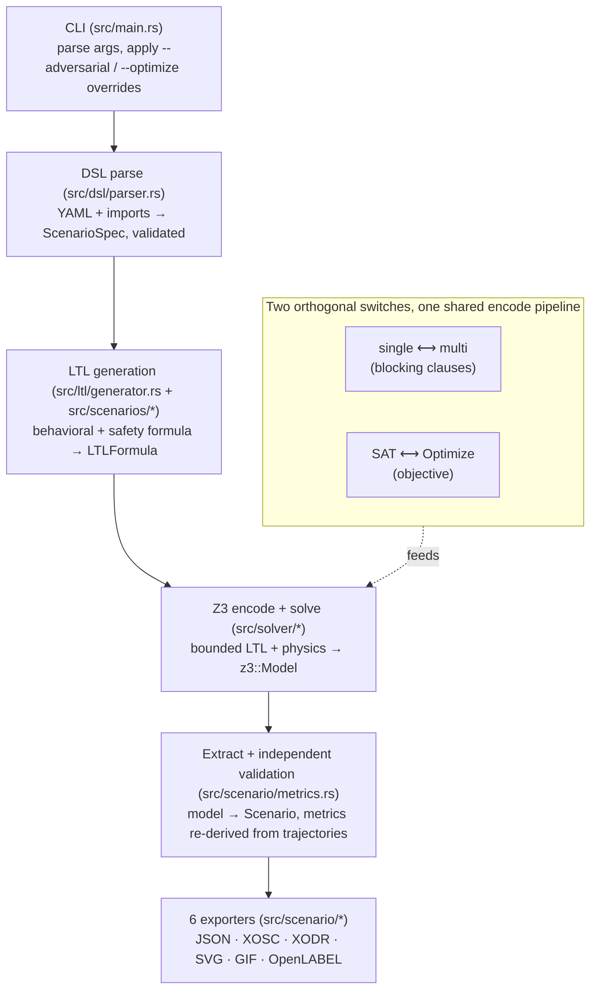

# Architecture

← [Back to README](../README.md)

ScenarioWeaver turns a short YAML description of a driving situation into a
concrete, physically consistent scenario: trajectories for every actor, plus the
road they drive on, exported in six formats. Between the input and the output sits
a temporal-logic specification and an SMT solver. What follows is that pipeline stage
by stage, the encoder design underneath it, and how the solver works.

## The pipeline at a glance

A single specification flows through five stages before it reaches the exporters.
Each stage owns one module and produces one data type.



The two switches inside the encode stage are not four separate code paths. Whether one
scenario is requested or several, and whether the solver merely satisfies the
constraints or optimizes an objective over them, the same constraint-encoding
sequence runs. Single-versus-multi is a loop with blocking clauses added between
iterations (`src/solver/multi_solve.rs`); SAT-versus-Optimize is a choice of Z3
backend plus one extra objective assertion (`src/solver/objectives.rs`). The
shared sequence is `encode_standard_pipeline` in `multi_solve.rs`, and every
solve attempt goes through it, so the two backends cannot silently diverge on which
constraints they encode. Adversarial generation is not a code path at all: the
`--adversarial` flag sets `constraint_modes` to `violate_all` and the ordinary
pipeline does the rest.

## Per-stage walkthrough

### CLI (`src/main.rs`)

The entry point parses arguments with `clap`, loads the specification through
`parse_yaml_file`, and applies two possible overrides before anything else runs:
`--adversarial` rewrites `constraint_modes` to the `ViolateAll` shorthand, and
`--optimize` sets the `optimization_target`. It then dispatches to
`generate_single_scenario_from_spec` or `generate_multiple_scenarios_from_spec`
and writes each result to disk. See the [user guide](user-guide.md) for the full
CLI reference.

### DSL parse (`src/dsl/parser.rs`) → `ScenarioSpec`

`parse_yaml_file` first preprocesses `imports:` (resolving each imported file
relative to the input file's own directory, currently used to pull in shared road
definitions), then deserializes the merged YAML into a `ScenarioSpec`. The struct
is declared `deny_unknown_fields`, so a typo in a field name is a parse error
rather than a silently ignored setting. Validation runs here, and it runs again
later at the canonical point described below. The complete field-by-field schema is
documented in the [YAML reference](yaml-reference.md).

### LTL generation (`src/ltl/generator.rs` + `src/scenarios/*`) → `LTLFormula`

`LTLGenerator::generate` is the single canonical validation point for every
generation path. It validates the spec and the scenario-type model, then builds the
complete formula as the conjunction of two parts:

- the **behavioral** formula, produced by the scenario type's `generate_ltl`, which
  encodes what makes this a cut-in or an overtake or a crossing (lane changes,
  ordering, the manoeuvre itself); and
- the **safety** formula, produced by `generate_safety`, whose default implementation
  emits pairwise time-to-collision and distance constraints plus per-actor velocity
  and lateral-distance constraints, each according to its configured constraint mode.

Both parts are `LTLFormula` values, a small AST of the usual temporal operators
(`Always`, `Eventually`, `Until`, `Next`) over boolean connectives and atomic
`Proposition`s. Validation is deliberately re-run here even for a spec that was
already validated during parsing, because a caller may mutate the spec after
parsing (overriding the duration, say) and must not be able to bypass the checks by
doing so.

### Z3 encode and solve (`src/solver/*`) → `z3::Model`

The encoder translates the `LTLFormula` and the physics of every actor into SMT
constraints and hands them to Z3. It is described in its own section below. On a
satisfiable problem Z3 returns a model: a concrete assignment to every variable at
every time step. Unsatisfiable and unknown are distinguished all
the way out to the caller, since a solver timeout is not a proof that no scenario
exists.

### Extract and independently validate (`src/scenario/metrics.rs`) → `Scenario`

This stage does two things. It reads the trajectories out of the Z3 model into a
`Scenario` (positions, velocities, accelerations, and lane assignments per actor per
time step), and then it **independently re-derives the validation metrics** from those
extracted
trajectories. The minimum time-to-collision, the minimum distance, the per-actor
velocity and acceleration bounds are all recomputed here in plain arithmetic, not
read back from the solver. This is a deliberate audit: it is the only place a
generated scenario is checked against its spec independently of the solver that
produced it, so a bug in the encoding cannot certify its own output as safe.

`src/scenario/extractor.rs` is a thin public wrapper around this logic. It exposes a
stable `extract_scenario_from_model` entry point and exists as an extension point;
the real work is in the `GenericEncoder::extract_scenario` implementation that
`metrics.rs` provides.

The validation code carries one caveat that matters for spec authors. The top-level
`max_acceleration` and `max_deceleration` fields are report-only: the
validator records violations against them but they are never asserted as solver
constraints. The bound the solver actually enforces is each actor's own
`acceleration` range. By contrast, `max_lateral_acceleration` is a genuine solver
constraint.

### Export (`src/scenario/*`)

The finished `Scenario` is written to six formats: JSON (the canonical
serialization), OpenSCENARIO 1.3 `.xosc` (which references a sibling `.xodr`),
OpenDRIVE 1.7 `.xodr`, a static top-down `.svg`, an animated `.gif` at 10 FPS, and
OpenLABEL 1.0.0 `.ol.json` with one object per actor and one frame per time step.
The XODR is written before the XOSC so the road filename is ready for the XOSC to
reference. See [output formats](output-formats.md) for the details of each.

## The encoder architecture

The solver layer supports more than one coordinate system without duplicating the
constraint logic, and it does so through a trait-based plugin design.

### `CoordinateEncoder<B>`: the plugin point (`src/solver/coordinate_encoder.rs`)

`CoordinateEncoder<B>` is the trait every coordinate system implements. It defines
how Z3 variables are created for all actors across the time horizon, how the
kinematic equations and the velocity, acceleration, and lane constraints are
encoded, and how a trajectory is read back out of a solved model. It is generic over
the backend `B`, so the same encoder serves both the SAT and the optimizer paths.
Constraint-writing code reaches an actor's state only through the trait's accessor
methods (`get_longitudinal_pos`, `get_lateral_vel`, `get_lane_var`, and the rest),
never through encoder fields directly.

### `GenericEncoder<B>`: the facade (`src/solver/encoder.rs`)

`GenericEncoder<B>` is a thin facade that holds a `Box<dyn CoordinateEncoder<B>>`
and selects the concrete encoder at construction time from `spec.coordinate_system`.
It delegates variable creation, kinematics, and the coordinate-specific constraints
straight to the trait object, and it adds the parts that are the same regardless of
coordinate system: `encode_ltl` (which hands off to the bounded-LTL expansion in
`src/ltl/encode.rs`), extraction and validation (implemented in
`src/scenario/metrics.rs`), and objective encoding for the optimizer backend
(implemented in `src/solver/objectives.rs`). The type alias
`Z3Encoder = GenericEncoder<SolverBackend>` names the common SAT-solving case;
the optimizer path uses `GenericEncoder<OptimizerBackend>` directly.

### The two concrete encoders (`src/solver/encoders/`)

Two coordinate systems ship today, both selected in YAML by
`coordinate_system: cartesian | bicycle`:

| Encoder | Model | State variables |
|---------|-------|-----------------|
| `CartesianEncoder` (`cartesian.rs`) | 2D point-mass | `x`, `y`, `vx`, `vy`, `ax`, `ay`, `lane` |
| `BicycleEncoder` (`bicycle.rs`) | kinematic bicycle | above plus heading `θ` and steering `δ` |

The heading and steering variables are not cosmetic: the bicycle model derives lateral
motion from them, so removing them would change the exported trajectory. Neither is
exported, so a user sees their effect only through `x`, `y`, `vx`, and `vy`.
Pedestrians are handled by a shared 2D point-mass sub-model
(`src/solver/encoders/pedestrian.rs`) that both encoders delegate to for any actor
with `role: pedestrian`; it is not a third coordinate system. The dynamics, the
linearization the bicycle model relies on, and the pedestrian sub-model are all
covered in [coordinate systems](coordinate-systems.md).

## How the solver works

The core idea is bounded model checking. Time is discretized into a finite number of
steps over a fixed horizon, and the LTL formula is expanded across those steps into
an ordinary boolean formula. `Always(φ)` becomes the conjunction of `φ` at every
remaining step; `Eventually(φ)` becomes the disjunction; `Until` and `Next` unroll
the same way. Each atomic proposition is lowered to a Z3 constraint over the actor
variables at a specific step. Alongside the expanded formula, the encoder asserts the
physics: the kinematic update equations, the initial conditions, and the velocity,
acceleration, and lane bounds. Z3 then searches for an assignment that satisfies all
of it at once, and that assignment is the scenario.

A defining property of this encoding is that it stays inside linear real arithmetic
(QF_LRA). This is a deliberate constraint that runs through every part of the
encoder. QF_LRA is decidable, so Z3 answers definitively rather than returning
"unknown", and Z3's `Optimize` backend has usable support for it, which the nonlinear
fragments do not have. Keeping the encoding linear has a cost. The bicycle model's
true dynamics are nonlinear (products of variables), so the encoder recovers
linearity through a small-angle approximation and a constant reference-speed
linearization: each actor's speed range is split into buckets, a boolean selects the
bucket a given step falls in, and the constant midpoint of that bucket stands in for
the variable speed inside the products. Time-to-collision is a division and therefore
cannot be a linear objective at all, so the optimizer ranks scenarios against a set of
constant TTC thresholds rather than against TTC directly. Each assertion is a
comparison between existing variables with no variable-by-variable products, which
keeps the problem in the fragment Z3 can both decide and optimize.

The per-constraint SMT encoding, with the exact formulas for each proposition and each
kinematic update, is documented for contributors in
[z3_constraints.md](z3_constraints.md).

## Scenario types and the `ScenarioModel` trait

A scenario type is a behavior, and each one is a `ScenarioModel`
(`src/scenarios/mod.rs`). The trait requires a single method, `generate_ltl`, which
produces the behavioral formula for that scenario. Three further methods have
defaults: `validate` for scenario-specific checks, `generate_safety` for the pairwise
safety formula (most scenario types keep the default), and
`add_z3_constraints` for the rare case that needs direct Z3 assertions beyond the LTL
encoding.

Five scenario types ship today. The `ScenarioType` enum in `src/dsl/types.rs` maps
each YAML `scenario_type` value to its model through `get_model`:

| `scenario_type` | Model | Behavior |
|-----------------|-------|----------|
| `cut_in_left` | `CutInLeftModel` | NPC cuts in from the left lane ahead of ego |
| `cut_in_right` | `CutInRightModel` | NPC cuts in from the right lane ahead of ego |
| `overtake_left` | `OvertakeLeftModel` | NPC overtakes ego via the left lane |
| `pedestrian_crossing` | `PedestrianCrossingModel` | pedestrian crosses while ego approaches |
| `head_on` | `HeadOnModel` | ego overtakes into the oncoming lane on a bidirectional road |

Adding a new type means implementing the trait and registering the variant. The full
walkthrough is in [creating scenario types](creating-scenario-types.md).

## Constraint modes and multi-scenario diversity

Each controllable safety constraint carries a mode, set either in bulk or per
constraint (see the [YAML reference](yaml-reference.md)):

- **Enforce** lowers the constraint to `G(c)`: it must hold at every step.
- **Violate** lowers it to `F(¬c)`: its negation must hold at some step.
- **Ignore** omits the constraint entirely.

A single helper, `push_constraint`, turns each `(mode, atom)` pair into the right
formula, so all controllable constraints share one implementation. Adversarial
generation is simply every mode set to Violate, which the `--adversarial` flag does
by selecting the `violate_all` shorthand; there is no separate adversarial code path.
See [adversarial generation](adversarial-generation.md).

When more than one scenario is requested, diversity comes from **blocking clauses**.
After each solve, the encoder asserts a clause that excludes the solution just found
(focused on NPC initial position and velocity), forcing Z3 to return a structurally
different trajectory on the next iteration.

## Module map

```
src/
  main.rs                    CLI entry point
  lib.rs                     Public API, single/multi and SAT/optimizer dispatch
  error.rs                   Error types
  dsl/
    types.rs                 ScenarioSpec, ActorSpec, RoadSpec, ScenarioType, ConstraintModes
    parser.rs                YAML parsing, import preprocessing, validation
  ltl/
    formula.rs               LTLFormula AST and Proposition variants
    generator.rs             LTLFormula generation, canonical validation point
    encode.rs                Bounded-LTL expansion + proposition → Z3 lowering
  solver/
    encoder.rs               GenericEncoder facade + shared TTC/conflict helpers
    coordinate_encoder.rs    CoordinateEncoder trait (the plugin point)
    encoders/
      cartesian.rs           CartesianEncoder (2D point-mass)
      bicycle.rs             BicycleEncoder (kinematic bicycle, linearized to QF_LRA)
      pedestrian.rs          Shared pedestrian point-mass sub-model
    encoder_utils.rs         Shared helpers: lane-change resolution, value extraction
    objectives.rs            Optimizer objective encoding (GenericEncoder<OptimizerBackend>)
    multi_solve.rs           encode_standard_pipeline + blocking-clause diversity
    backend.rs               SolverBackend / OptimizerBackend traits
  scenarios/
    mod.rs                   ScenarioModel trait + default safety
    cut_in_left.rs           per-type behavioral models
    cut_in_right.rs
    overtake_left.rs
    pedestrian_crossing.rs
    head_on.rs
  scenario/
    model.rs                 Scenario, ActorTrajectory, State, ValidationInfo
    extractor.rs             Thin public wrapper around extract_scenario
    metrics.rs               Extraction + independent metric re-derivation
    xosc_exporter.rs         OpenSCENARIO export
    xodr_exporter.rs         OpenDRIVE export
    openlabel_exporter.rs    OpenLABEL export
    svg_visualizer.rs        SVG static visualization
    gif_animator.rs          GIF animation export
```

## Related documents

- [User guide](user-guide.md): install, quick start, CLI reference
- [YAML reference](yaml-reference.md): the complete specification schema
- [Creating scenario types](creating-scenario-types.md): adding a `ScenarioModel`
- [Coordinate systems](coordinate-systems.md): Cartesian, bicycle, and the pedestrian sub-model
- [Output formats](output-formats.md): the six exported formats
- [Optimizer](optimizer.md): optimization targets and the LRA boundary
- [Adversarial generation](adversarial-generation.md): constraint modes and violation
- [Z3 constraints](z3_constraints.md): the per-constraint SMT encoding (advanced)
